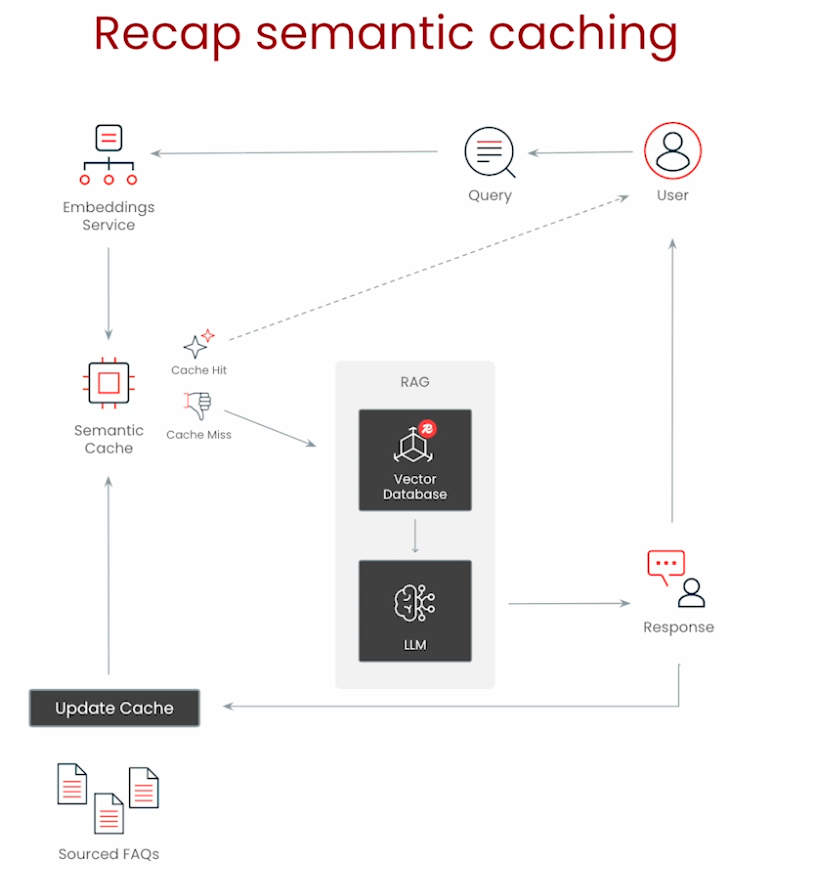

# Build Your First Semantic Cache

Build a semantic cache from scratch, then redo it with Redis + RedisVL.
Use case: customer support FAQ.

## Recap flow



```text
Query -> Embeddings Service -> Semantic Cache
   cache hit  -> return answer straight to user
   cache miss -> RAG (Vector Database -> LLM) -> Response -> user
                 then Update Cache with the new Q/A
Sourced FAQs preload the cache up front.
```

Caveman: check meaning first. Seen it? answer fast. Not seen? do RAG, then remember it.

## Part 1 — from scratch (numpy)

Goal: see every moving part before hiding it behind an SDK.

Steps:

1. **Load FAQ dataset** — question/answer pairs + test set (from CSV).
2. **Embed** with `SentenceTransformer("all-mpnet-base-v2")` — encode all FAQ questions into vectors.
3. **Semantic search** — cosine distance between query embedding and the FAQ matrix; pick lowest distance (`argmin`).
4. **check_cache(query, distance_threshold=0.3)** — if best distance ≤ threshold → HIT (return prompt+response+distance); else → MISS (None).
5. **add_to_cache(q, a)** — append row to the dataframe and `vstack` the new embedding onto the matrix. Cache grows over time.

Key numbers from the lab:

- "How long will it take to get a refund for my order?" → nearest FAQ "How do I get a refund?", distance `0.331`.
- "Is it possible to get a refund?" → HIT at `0.262`.
- After adding 3 entries (8 → 11), previously-missing queries ("What time do you open?", etc.) now HIT.

Mental model:

```text
distance = 1 - cosine_similarity
lower distance = closer meaning
threshold = how strict:  loose = more hits + more risk,  strict = fewer hits + safer
```

## Part 2 — production with Redis

**Redis** = REmote DIctionary Server. Open-source, fast, in-memory key-value DB.
It also does secondary indexing (vectors, text, numerics, tags, geo) — that is what makes
semantic caching in Redis possible.

Why Redis over the numpy version:

- Low-latency vector search (fast insert + check at scale).
- Distributes data across nodes; apps read/write concurrently.
- Built-in **TTL / eviction / namespacing** for freshness and tenant isolation.

Pipeline in code:

```python
r = redis.Redis.from_url(REDIS_URL)         # redis://localhost:6379

# cache-optimized, fine-tuned embedding model (open weight, HuggingFace)
langcache_embed = HFTextVectorizer(
    model="redis/langcache-embed-v1",
    cache=EmbeddingsCache(redis_client=r, ttl=3600),
)

cache = SemanticCache(
    name="faq-cache",           # unique namespace in the DB
    vectorizer=langcache_embed,
    redis_client=r,
    distance_threshold=0.3,
)

for i in range(len(faq_df)):    # hydrate cache with FAQ data
    cache.store(prompt=faq_df.iloc[i]["question"],
                response=faq_df.iloc[i]["answer"])

cache.check("I need a refund for my purchase")   # -> hit at distance 0.25 (< 0.3)
cache.set_ttl(86400)            # keep cache fresh: evict after 1 day
```

Notes:

- `langcache-embed-v1` is fine-tuned specifically for caching → better hit accuracy than the generic mpnet model.
- `name=` creates a namespace; different tenants/apps stay isolated.
- `EmbeddingsCache(ttl=3600)` also caches the *embeddings* themselves (don't re-embed the same text).

## Part 3 — end-to-end with LLM + perf eval

Loop: for each test question → `cache.check` → HIT return cached; MISS call `gpt-4o-mini`
(via LangChain `ChatOpenAI`), then `cache.store` the fresh answer.

Result:

- Cache hit ≈ **65 ms** average.
- LLM call ≈ **> 1 second** average.
- (LLM latency here is mocked/random, but the gap is representative.)

Takeaway: cache turns a ~1s+ LLM call into a ~65ms lookup for repeated meaning.
Next lesson covers measuring cache effectiveness (accuracy + performance metrics) properly.

## Redis primer (from side chats)

Got confused on Redis basics — here is the grounded version.

**Key vs value**: the key is the name/label you choose; the value is the data stored under it.
`SET name Alice` → key `name`, value `Alice`. Redis does **not** auto-generate keys; you name them
(e.g. `user:123`, `orders`, `faq-cache`).

**Data types** = the *shape* of the value. Same key→value idea, different container:

- String — one value.
- Hash — labeled fields (an object), commands start `H` (HSET/HGET).
- List — ordered queue, `L` (LPUSH/LPOP).
- Set — unique items, `S` (SADD).
- Sorted set — `Z` (ZADD).
- Stream — append-only event log, `X` (XADD/XREAD).

**Command naming trick**: the first letter tells you the data type; the rest is a plain verb.
`XADD` = X (stream) + ADD. Not a fancy acronym. `HGETALL` = hash + get + all. `LPUSH` = list + push.
(X and Z were picked mostly because the good letters were already taken.)

**Streams specifics** (for the Redis Stream data type):

```text
XADD orders * user_id 123 item "book" price 25
      |     |  \_______ field/value pairs ______/
      key   auto-generate entry ID (*)

orders  -> Stream
  1692632147973-0 : user_id=123, item=book, price=25   <- entry ID = timestamp-counter
```

- **entry ID** like `1692632147973-0` = timestamp + a counter (for same-millisecond collisions); like a line number in a logbook.
- `*` = "Redis, generate the entry ID for me."
- **field/value pairs** = labeled details inside one entry, so the event is self-describing.

Why commands exist at all: Redis is a server holding data in memory; commands are the only
language to tell it store/fetch/append. No command = silent box you can't reach.

## What this lesson is — and is not

This notebook is intentionally the simple inner mechanism of semantic caching.
It is **not** the full production architecture from the overview lesson.

The full production mental model from Lesson 1 was:

```text
User query
  -> Decision Engine / safety gate
       -> if risky, fresh, contextual, temporal, code, forecast, pricing, policy-sensitive:
             skip semantic cache and use tools / database / RAG / LLM
       -> if safe, reusable, non-personal, non-temporal:
             try semantic cache
  -> cache hit: return cached answer
  -> cache miss: call RAG/LLM/tool, then maybe store answer
```

This Lesson 2 notebook mostly shows only this smaller inner piece:

```text
User query
  -> embed query
  -> vector similarity search over cached prompts
  -> distance threshold check
  -> hit or miss
```

So if something feels "too simple," that is correct. The notebook is teaching the cache primitive before adding the production guardrails.

A production system needs the missing first layer:

```text
Decision Engine asks: should cache even be attempted?
```

Examples:

```text
"How do I reset my password?"
  -> generic FAQ, likely safe
  -> try semantic cache

"What is my refund window for order 123?"
  -> needs order/product/date/user context
  -> fetch facts first, or use context-filtered cache only

"Will demand increase next week?"
  -> forecast / fresh-data question
  -> skip old cached answer; route to forecasting/data pipeline

"What is the current price today?"
  -> temporal/freshness-sensitive
  -> skip cache or require strict TTL/version metadata

"Fix this code bug"
  -> code is brittle; tiny differences matter
  -> skip semantic response cache unless very carefully designed
```

## Cell-by-cell notebook explanation

### 1. Warning cleanup

```python
import warnings
warnings.filterwarnings('ignore')
```

This only suppresses warning messages so the notebook output stays clean. It has nothing to do with semantic caching.

### 2. Load libraries and course FAQ data

```python
import pandas as pd
import numpy as np
import time

from cache.faq_data_container import FAQDataContainer

faq_data = FAQDataContainer()
faq_df = faq_data.faq_df
test_df = faq_data.test_df
```

What each part does:

- `pandas` handles tabular FAQ data.
- `numpy` handles vector math.
- `time` supports later timing/performance measurements.
- `FAQDataContainer` is a **course helper**, not a Redis library and not standard Python.

After this cell:

```text
faq_df  = dataframe of FAQ question/answer pairs
test_df = dataframe of test examples from course materials
```

The semantic cache is built around the FAQ rows.
Each row is roughly:

```text
question: "How do I get a refund?"
answer:   "To request a refund, visit..."
```

### 3. Display the FAQ data

```python
faq_df.head().style
```

This just shows the first few FAQ rows.
The important point is that the cache has two human-readable fields:

```text
prompt/question -> response/answer
```

### 4. Load an embedding model and embed FAQ questions

```python
from sentence_transformers import SentenceTransformer

encoder = SentenceTransformer("all-mpnet-base-v2")

faq_embeddings = encoder.encode(faq_df["question"].tolist())

print(f"Sample (first 10 dimensions): {faq_embeddings[0][:10]}")
```

This turns every FAQ question into a vector.

Example mental model:

```text
"How do I get a refund?"
  -> [0.12, -0.04, 0.88, ...]
```

`faq_embeddings` is just a numpy matrix in memory:

```text
row 0 vector -> FAQ row 0
row 1 vector -> FAQ row 1
row 2 vector -> FAQ row 2
...
```

At this stage, there is no Redis and no database. The vector matrix is the toy semantic index.

### 5. Define cosine distance

```python
def cosine_dist(a: np.array, b: np.array):
    """Compute cosine distance between two sets of vectors."""
    a_norm = np.linalg.norm(a, axis=1)
    b_norm = np.linalg.norm(b) if b.ndim == 1 else np.linalg.norm(b, axis=1)
    sim = np.dot(a, b) / (a_norm * b_norm)
    return 1 - sim
```

Cosine similarity measures how close two vectors point in the same direction.
Cosine distance is:

```text
distance = 1 - cosine_similarity
```

So:

```text
lower distance = closer meaning
higher distance = less similar meaning
```

This function is the math behind the toy semantic cache.

### 6. Define semantic search

```python
def semantic_search(query: str) -> tuple:
    """Find the most similar FAQ question to the query."""
    query_embedding = encoder.encode([query])[0]

    distances = cosine_dist(faq_embeddings, query_embedding)

    # Find the most similar question (lowest distance)
    best_idx = int(np.argmin(distances))
    best_distance = distances[best_idx]

    return best_idx, best_distance
```

This does four things:

```text
1. Embed the incoming user query.
2. Compare it against every FAQ question embedding.
3. Find the FAQ row with the smallest distance.
4. Return the row index and the distance score.
```

Important: this function does **not** decide hit or miss yet.
It only says:

```text
"This is the closest FAQ I found, and here is how close it is."
```

### 7. Test semantic search

```python
idx, distance = semantic_search(
    "How long will it take to get a refund for my order?"
)

print(f"Most similar FAQ: {faq_df.iloc[idx]['question']}")
print(f"Answer: {faq_df.iloc[idx]['answer']}")
print(f"Cosine distance: {distance:.3f}")
```

This shows semantic search working before it becomes a cache.

The query may not exactly match the FAQ text, but the embedding model should find that it is close to the refund FAQ.

Example:

```text
query: "How long will it take to get a refund for my order?"
closest FAQ: "How do I get a refund?"
distance: about 0.331
```

### 8. Define the simple semantic cache check

```python
def check_cache(query: str, distance_threshold: float = 0.3):
    """
    Semantic cache lookup for previously asked questions.
    Returns a dictionary with answer if hit, None if miss.
    """
    idx, distance = semantic_search(query)

    if distance <= distance_threshold:
        return {
            "prompt": faq_df.iloc[idx]["question"],
            "response": faq_df.iloc[idx]["answer"],
            "vector_distance": float(distance),
        }

    return None  # Cache miss
```

This is the first actual cache function.

It is deliberately simple:

```text
Find closest cached question.
If distance is small enough, return its answer.
Otherwise return None.
```

The key rule is:

```text
if distance <= threshold:
    HIT
else:
    MISS
```

For this notebook:

```text
threshold = 0.3
```

That means:

```text
0.26 <= 0.3 -> hit
0.45 > 0.3  -> miss
```

Threshold tradeoff:

```text
looser threshold -> more hits, more false-hit risk
stricter threshold -> fewer hits, safer answers
```

This is where the notebook shows the core idea, but not the full production safety system.
There is no Decision Engine here.
There is no temporal detector.
There is no forecast detector.
There is no user/order/product context gate.

### 9. Try a few cache lookups

```python
test_queries = [
    "Is it possible to get a refund?",
    "I want my money back",
    "What are your business hours?",  # Should miss
]

for query in test_queries:
    result = check_cache(query, distance_threshold=0.3)
    if result:
        print(f"✅ HIT: '{query}' -> {result['response'][:50]}...")
        print(f"   Distance: {result['vector_distance']:.3f}\n")
    else:
        print(f"❌ MISS: '{query}'\n")
```

This demonstrates hit/miss behavior.

Refund-like questions may hit the refund FAQ.
A business-hours question may miss if business-hours is not already in the FAQ cache.

### 10. Add new entries to the simple in-memory cache

```python
def add_to_cache(question: str, answer: str):
    """
    Add a new Q&A pair to our simple in-memory cache.
    Extends both the DataFrame and embeddings matrix.
    """
    global faq_df, faq_embeddings

    new_row = pd.DataFrame({"question": [question], "answer": [answer]})
    faq_df = pd.concat([faq_df, new_row], ignore_index=True)

    # Generate embedding for the new question
    new_embedding = encoder.encode([question])

    # Add to embeddings matrix
    faq_embeddings = np.vstack([faq_embeddings, new_embedding])

    print(f"✅ Added to cache: '{question}'")
```

The toy cache has two synchronized parts:

```text
faq_df          -> stores readable question and answer
faq_embeddings  -> stores vector for each question
```

When adding one new Q&A pair, the function must update both.

This is what a real cache library/database hides from you.

### 11. Add business-hours, mobile-app, and payment-method entries

```python
print("Original cache size:", len(faq_df))

new_entries = [
    (
        "What are your business hours?",
        "We're open Monday-Friday 9 AM to 6 PM EST. Weekend support is available for urgent issues.",
    ),
    (
        "Do you have a mobile app?",
        "Yes! Our mobile app is available on both iOS and Android. Search for 'CustomerApp' in your app store.",
    ),
    (
        "How do I update my payment method?",
        "Go to Account Settings > Payment Methods to add, edit, or remove payment options.",
    ),
]

for question, answer in new_entries:
    add_to_cache(question, answer)

print(f"\nCache now has {len(faq_df)} total entries")
```

This simulates the cache growing over time.

Before adding these entries, similar future queries may miss.
After adding them, related paraphrases can hit.

### 12. Test the expanded cache

```python
test_extended_queries = [
    "What time do you open?",  
    "Is there a phone app?", 
    "How can I change my payment method?",
]

for query in test_extended_queries:
    result = check_cache(query, distance_threshold=0.3)
    if result:
        print(f"✅ HIT: '{query}' -> {result['response'][:50]}...")
        print(f"   Distance: {result['vector_distance']:.3f}\n")
    else:
        print(f"❌ MISS: '{query}'\n")
```

This shows the payoff from adding cache entries.

Example:

```text
cached question: "What are your business hours?"
new query:       "What time do you open?"
```

These are not exact text matches, but they are close in meaning.
So the semantic cache can hit.

## Moving from toy numpy cache to RedisVL

The first half of the notebook manually built a semantic cache with:

```text
pandas dataframe + numpy vector matrix + cosine distance + threshold logic
```

The second half replaces that with Redis and RedisVL.

### 13. Configure Redis URL

```python
import os

REDIS_URL = os.getenv("REDIS_URL", "redis://localhost:6379")
```

This gets the Redis connection string from the environment.
If none is provided, it assumes Redis is running locally.

### 14. Connect to Redis

```python
import redis

try:
    r = redis.Redis.from_url(REDIS_URL)
    r.ping()
    print("✅ Redis is running and accessible")
except redis.ConnectionError:
    print("❌ Cannot connect to Redis")
    raise
```

This creates a Redis client and checks that Redis is reachable.

Redis is the backend database/cache server.
RedisVL is the Python library that makes Redis easier to use for vector and LLM workflows.

### 15. Create a cache-optimized vectorizer

```python
from redisvl.utils.vectorize import HFTextVectorizer
from redisvl.extensions.cache.embeddings import EmbeddingsCache

langcache_embed = HFTextVectorizer(
    model="redis/langcache-embed-v1",
    cache=EmbeddingsCache(redis_client=r, ttl=3600)
)
```

This swaps the generic embedding model for Redis's cache-oriented model:

```text
redis/langcache-embed-v1
```

Why it matters:

```text
all-mpnet-base-v2          -> general sentence embedding model
redis/langcache-embed-v1   -> tuned for semantic cache matching
```

`EmbeddingsCache` is also important.
It caches embeddings themselves for one hour:

```text
same text -> reuse embedding -> avoid re-embedding work
```

### 16. Create the RedisVL SemanticCache

```python
from redisvl.extensions.cache.llm import SemanticCache

cache = SemanticCache(
    name="faq-cache",
    vectorizer=langcache_embed,
    redis_client=r,
    distance_threshold=0.3
)
```

This is the main RedisVL abstraction.

`SemanticCache` is a real RedisVL library class, not a course helper.
It gives a convenient API around Redis-backed semantic response caching.

The important parameters:

```text
name="faq-cache"          -> namespace/cache name in Redis
vectorizer=langcache_embed -> embedding model used for prompts
redis_client=r             -> Redis connection
threshold=0.3              -> hit/miss cutoff
```

Conceptually, this class replaces the hand-written functions:

```text
semantic_search(...)
check_cache(...)
add_to_cache(...)
```

But with a key nuance:

```text
RedisVL handles the cache machinery.
Your application still decides when to call check(), when to call the LLM, and when to call store().
```

### 17. Load FAQ data into Redis SemanticCache

```python
for i in range(len(faq_df)):
    cache.store(
        prompt=faq_df.iloc[i]["question"],
        response=faq_df.iloc[i]["answer"]
    )
```

This hydrates/preloads the Redis cache with trusted FAQ data.

For each FAQ row, RedisVL stores roughly:

```text
prompt/question
response/answer
prompt embedding vector
cache metadata/internal fields
```

The exact storage format is managed by RedisVL.
You do not manually create the vector index in this notebook.

### 18. Check the Redis cache

```python
result = cache.check("I need a refund for my purchase")
```

This is the RedisVL version of:

```python
check_cache("I need a refund for my purchase")
```

It embeds the query, searches the Redis vector index, applies the distance threshold, and returns matching cached responses if found.

### 19. Inspect the result

```python
result
```

Expected result shape is a list-like result containing fields such as:

```text
prompt
response
vector_distance
metadata/internal fields
```

If the distance is below `0.3`, it is a hit.
If nothing qualifies, the result is empty or falsey depending on the exact library behavior/version.

### 20. Set TTL

```python
cache.set_ttl(86400)
```

TTL means time to live.

```text
86400 seconds = 1 day
```

This helps keep cached answers fresh by expiring old entries.
TTL is one of the big reasons Redis is useful for cache systems.

## End-to-end LLM example

### 21. Load OpenAI/LangChain pieces

```python
from cache.config import load_openai_key
from langchain_openai import ChatOpenAI
from langchain_core.messages import HumanMessage

load_openai_key()

MODEL_NAME = "gpt-4o-mini"

llm = ChatOpenAI(
    model=MODEL_NAME,
    temperature=0.1,
    max_tokens=150,
)
```

`load_openai_key` is another course helper.
It is not Redis.

`ChatOpenAI` is the LangChain wrapper around OpenAI chat models.

The model is configured to be fairly deterministic:

```text
temperature=0.1
```

and concise:

```text
max_tokens=150
```

### 22. Define LLM fallback function

```python
def get_llm_response(question: str) -> str:
    prompt = f"""
    You are a helpful customer support assistant. Answer this customer question concisely and professionally:
    
    Question: {question}
    
    Provide a helpful response in 1-2 sentences. If you don't have specific information, give a general helpful response.
    """
    response = llm.invoke([HumanMessage(content=prompt)])
    return response.content.strip()
```

This is what happens on cache miss.

If the cache cannot answer, the notebook asks the LLM to generate a fresh customer-support answer.

### 23. Create performance evaluator and test questions

```python
from cache.evals import PerfEval

perf_eval = PerfEval()
```

`PerfEval` is a course-provided helper.
It is not RedisVL and not standard Python.

Its job is to measure the demo:

```text
how many cache hits
how many cache misses
how long cache hits take
how long LLM calls take
which LLM calls happened
```

The test questions include refund, password reset, shipping, installation, support call, and cancellation examples.

### 24. Run the full cache-first loop

```python
with perf_eval:
    for i, question in enumerate(test_questions, 1):
        print(f"\n[{i}] Question: '{question}'")

        perf_eval.start()

        if cached_result := cache.check(question):
            # Cache HIT
            perf_eval.tick("cache_hit")
            print(
                f"    ✅ CACHE HIT (distance: {cached_result[0]['vector_distance']:.3f})"
            )
            print(f"    📋 Cached question: {cached_result[0]['prompt'][:80]}...")
            print(f"    📋 Cached response: {cached_result[0]['response'][:80]}...")
        else:
            # Cache MISS - call LLM
            perf_eval.tick("cache_miss")  # Time for cache check
            print(f"    ❌ CACHE MISS")
            print(f"    🤖 Calling LLM... ", end="")

            # Call LLM and track the call
            perf_eval.start()
            llm_response = get_llm_response(question)
            perf_eval.tick("llm_call")
            perf_eval.record_llm_call(MODEL_NAME, question, llm_response)
            print(f"    💬 LLM response: {llm_response[:80]}...")
            cache.store(prompt=question, response=llm_response)
```

This is the full simple application pattern:

```text
for each question:
  check semantic cache
  if hit:
      return cached response
  if miss:
      call LLM
      store new question/response in cache
      return LLM response
```

Important nuance:

```text
RedisVL does not magically know your application should call the LLM on miss.
Your code does that.
```

Also:

```text
RedisVL does not automatically store every miss by itself in this notebook.
The notebook explicitly calls cache.store(...) after the LLM response.
```

So RedisVL handles the low-level cache mechanics, but the application owns the business flow.

### 25. Measure average cache-hit time

```python
np.mean(perf_eval.durations_by_label['cache_hit'])
```

This computes the average latency for cache hits.
In the course notes, cache hit time is around tens of milliseconds, roughly `65 ms`.

### 26. Measure average LLM-call time

```python
np.mean(perf_eval.durations_by_label['llm_call'])
```

This computes the average latency for LLM calls.
In the course notes, this is over a second.

The point is the ratio:

```text
cache hit: fast
LLM generation: slower and more expensive
```

### 27. Clear the cache

```python
cache.clear()
```

This deletes the cache data and resets the environment.

## Is RedisVL SemanticCache doing the cache machinery?

Yes, mostly. RedisVL's `SemanticCache` is doing the boring semantic-cache machinery for you.

It handles:

- embedding the prompt/query using the configured vectorizer
- storing the prompt and response
- storing/searching the prompt vector
- storing metadata if you provide metadata / depending on API usage
- creating/using the Redis vector index abstraction
- vector similarity search
- distance-threshold hit/miss filtering
- returning cached responses on hits
- TTL / expiry support
- namespace-like separation through cache names such as `name="faq-cache"`
- Redis-backed fast lookup

But be precise about these boundaries:

- It does **not** decide whether a query is safe to cache. That is the missing Decision Engine layer.
- It does **not** automatically call your LLM on a miss. Your application code does that.
- It does **not** automatically store a miss after generation unless your application calls `cache.store(...)`, as this notebook does.
- It does **not** guarantee a cached answer is correct. Thresholds can create false hits.
- It does **not** solve user/order/product/date context by itself. You need metadata filters, tenant isolation, namespaces, or a Decision Engine.
- Redis-backed persistence depends on Redis configuration. Redis is in-memory first; durable persistence requires Redis persistence settings such as RDB/AOF or a managed Redis configuration.

Best short version:

```text
RedisVL SemanticCache handles embedding, vector search, threshold matching, Redis storage, TTL, and returning hits.
Your app handles safety, routing, LLM fallback, and deciding what to store.
```

## What are these unique libraries?

### `from redisvl.extensions.cache.llm import SemanticCache`

This is a real RedisVL library class.
It is not a course-only helper.

RedisVL is Redis's Python toolkit for vector search and LLM-oriented workflows on Redis.
`SemanticCache` gives a high-level API for semantic response caching.

Useful methods in this notebook:

```python
cache.store(prompt=..., response=...)
cache.check("some question")
cache.set_ttl(86400)
cache.clear()
```

### `from cache.evals import PerfEval`

This is a course helper.
It likely lives in the course lab's local `cache/` folder.

It measures timings and counts events for the lesson.
It is not the semantic cache itself.
It is not a Redis product.

### Other course helpers

These are also course/lab helpers:

```python
from cache.faq_data_container import FAQDataContainer
from cache.config import load_openai_key
```

They exist to load data and secrets cleanly in the notebook environment.

## If not RedisVL, what else could be used?

Deep-research conclusion: if you do not want Redis and you do not want to write your own wrapper, the best local notebook replacement is usually **GPTCache with SQLite + FAISS**.

Why GPTCache fits this notebook:

```text
It is purpose-built for semantic LLM response caching.
It can run locally.
It avoids Redis.
It supports scalar storage plus vector search.
It has higher-level cache setup APIs.
It can use FAISS for vector similarity and SQLite for stored responses.
```

Practical recommendation:

```text
Notebook/local/simple: GPTCache + sqlite,faiss
Proxy/gateway architecture: LiteLLM Proxy + Qdrant semantic cache
Already using LangChain heavily: LangChain semantic cache integration
RAG ingestion workflows: LlamaIndex, but not as a direct SemanticCache replacement
```

### Option 1: GPTCache

Best fit when:

```text
You want a Python-side semantic response cache.
You do not want Redis.
You do not want to write your own cache wrapper.
You want the notebook to stay self-contained.
```

Backends found in research include combinations such as:

```text
scalar stores: SQLite, PostgreSQL, MySQL, MariaDB, SQL Server, Oracle, DuckDB-related examples
vector stores: FAISS, Chroma, HNSWLib, pgvector, Qdrant, Milvus, Redis, Usearch, Weaviate, DocArray
```

Lowest-ops notebook choice:

```text
SQLite for response storage
FAISS for vector similarity search
```

Sources:

```text
https://gptcache.readthedocs.io/en/latest/
https://gptcache.readthedocs.io/en/latest/references/manager.html
```

### Option 2: LiteLLM Proxy semantic cache

Best fit when:

```text
You are okay routing LLM calls through a proxy.
You want provider portability.
You want a non-Redis semantic cache backend.
```

LiteLLM Proxy documents semantic caching with Qdrant:

```text
cache_params:
  type: qdrant
  mode: semantic
```

This is less like importing a local `SemanticCache` class and more like running an LLM gateway.
Your notebook/app points to the proxy, and the proxy handles caching.

Source:

```text
https://docs.litellm.ai/docs/proxy/caching
```

### Option 3: LangChain semantic caches

Best fit when:

```text
Your app already uses LangChain model calls.
You want caching to plug into LangChain's LLM call path.
You are using one of LangChain's existing semantic-cache backends.
```

LangChain does have semantic cache integrations, but the important research finding is that LangChain is **not** currently the clean answer for Postgres/pgvector semantic response caching.

Found LangChain semantic cache classes include:

```text
RedisSemanticCache
CassandraSemanticCache / Astra semantic cache path
AzureCosmosDBSemanticCache
AzureCosmosDBNoSqlSemanticCache
OpenSearchSemanticCache
SingleStoreDBSemanticCache
GPTCache adapter/integration
```

What was **not** found:

```text
No official PostgresSemanticCache
No official PGVectorSemanticCache
No ready LangChain class that is equivalent to RedisVL SemanticCache but backed by pgvector
```

LangChain does have `PGVector`, but that is a vector store integration, not a complete LLM semantic response cache. In other words, `PGVector` can store/search vectors, but it does not automatically give you the full cache behavior:

```text
LLM prompt -> embedding -> pgvector search -> threshold hit/miss -> cached response -> TTL/staleness policy -> store miss response
```

To use LangChain + pgvector as a semantic response cache, you would likely need to implement a custom LangChain `BaseCache` or glue together the vector store plus response storage yourself. That violates the original goal of "I do not want to make my own wrapper."

So the practical conclusion is:

```text
If using LangChain and one of its supported semantic cache backends fits, LangChain is convenient.
If specifically using Postgres/pgvector, LangChain is not currently a no-wrapper replacement for RedisVL SemanticCache.
If you want pgvector without writing the wrapper, GPTCache + pgvector is still the more relevant path to investigate.
```

This is less ideal if your app uses direct OpenAI/Anthropic SDK calls and you want a standalone cache object. It is also less ideal if your desired backend is specifically Postgres/pgvector and you want the library to provide the semantic response cache abstraction for you.

Sources:

```text
https://python.langchain.com/docs/integrations/llm_caching/
https://reference.langchain.com/python/integrations/langchain_community/cache/
https://raw.githubusercontent.com/langchain-ai/langchain-postgres/main/langchain_postgres/vectorstores.py
```

### Option 4: LlamaIndex

LlamaIndex is excellent for RAG and vector-store workflows, but it is not the closest direct replacement for RedisVL `SemanticCache` in this notebook.

The researched docs show caching mainly around ingestion pipeline transformations, not semantic LLM response caching.

Use it if your goal is:

```text
cache/reuse RAG ingestion artifacts
manage vector stores for retrieval
build a RAG pipeline
```

Do not choose it if your immediate goal is:

```text
replace cache.check(...) and cache.store(...) without writing glue code
```

Sources:

```text
https://developers.llamaindex.ai/python/framework/module_guides/loading/ingestion_pipeline/#caching
https://developers.llamaindex.ai/python/framework/module_guides/storing/vector_stores/
```

### Option 5: Gateways such as Portkey, Helicone, Cloudflare

Portkey supports semantic caching, but it is a product/gateway choice and may depend on deployment or plan details.

Helicone and Cloudflare AI Gateway are useful for response caching, but the researched docs mainly show exact/request-key caching rather than current semantic vector caching.

Sources:

```text
https://portkey.ai/docs/product/ai-gateway-streamline-llm-integrations/cache-simple-and-semantic
https://docs.helicone.ai/features/advanced-usage/caching
https://developers.cloudflare.com/ai-gateway/configuration/caching/
```

## RedisVL vs alternatives in one view

```text
RedisVL SemanticCache
  Best when: you are okay with Redis and want a clean semantic cache API.
  Strength: Redis TTL, vector search, namespaces, fast cache operations.
  Limitation: Redis-specific backend.

GPTCache
  Best when: you want a local Python semantic response cache without Redis.
  Strength: purpose-built semantic LLM cache, multiple vector/scalar backends.
  Limitation: check maintenance/version fit before production.

LiteLLM Proxy + Qdrant
  Best when: you want gateway-level caching and model-provider portability.
  Strength: centralizes caching outside the app.
  Limitation: requires proxy architecture.

LangChain semantic caches
  Best when: your LLM calls already go through LangChain and a supported semantic-cache backend fits.
  Strength: easy registration with LangChain call path for supported cache classes.
  Limitation: no official no-wrapper Postgres/pgvector semantic response cache found; PGVector is a vector store, not a full cache.

LlamaIndex
  Best when: you are caching ingestion/RAG artifacts.
  Strength: strong RAG ecosystem.
  Limitation: not a direct semantic response-cache replacement.
```

## Better production architecture with Decision Engine

A production version of this notebook should not call semantic cache blindly.
It should add a first-layer gate.

```text
                             ┌──────────────────┐
                             │   User Query      │
                             └────────┬─────────┘
                                      │
                                      v
                      ┌─────────────────────────────┐
                      │ Decision Engine / Router     │
                      │ Should cache be attempted?   │
                      └───────┬─────────────┬───────┘
                              │             │
                         safe │             │ unsafe / fresh / contextual
                              │             │
                              v             v
                   ┌──────────────────┐   ┌────────────────────────┐
                   │ Semantic Cache    │   │ Tools / DB / RAG / LLM  │
                   │ Similarity Check  │   │ Fresh computation path  │
                   └────────┬─────────┘   └───────────┬────────────┘
                            │                         │
                   ┌────────┴────────┐                │
                   │                 │                │
                   v                 v                v
             ┌──────────┐      ┌──────────┐    ┌──────────────┐
             │ Cache Hit │      │Cache Miss │    │ Fresh Answer │
             └────┬─────┘      └────┬─────┘    └──────┬───────┘
                  │                 │                 │
                  v                 v                 │
        ┌─────────────────┐   ┌──────────────────┐    │
        │ Return cached    │   │ RAG / Tool / LLM  │<───┘
        │ response         │   │ generates answer  │
        └─────────────────┘   └────────┬─────────┘
                                       │
                                       v
                              ┌──────────────────┐
                              │ Maybe store in    │
                              │ semantic cache    │
                              └────────┬─────────┘
                                       │
                                       v
                              ┌──────────────────┐
                              │ Return response   │
                              └──────────────────┘
```

Decision Engine examples:

```text
Code Detector
  If query asks to write/debug/analyze code, skip cache or use extremely strict rules.

Temporal Context Detector
  If query asks about now/today/latest/current/recent, skip cache or require freshness metadata.

Forecast Detector
  If query asks what will happen next week/month/quarter, route to forecasting/data pipeline.

User/Order/Product Context Detector
  If answer depends on user facts, order facts, product type, purchase date, region, plan, subscription, or tenant, fetch context first or restrict cache search to matching metadata.

Policy/Pricing Version Detector
  If answer depends on policy version, catalog version, or price date, require matching metadata.

Similarity Evaluator
  Only after the query passes safety gates should semantic similarity decide hit/miss.
```

Production-safe cache key is not just:

```text
meaning(query)
```

It is closer to:

```text
meaning(query)
+ tenant
+ user/account class when relevant
+ product/category
+ region
+ policy version
+ freshness timestamp
+ permission boundary
```

## Caveman summary

- Lesson 2 simple cache = embed FAQs, cosine distance, threshold 0.3, grow over time.
- No Decision Engine in this notebook; it is only the inner cache mechanic.
- RedisVL version = same idea but Redis handles vector storage/search, TTL, and cache APIs.
- `SemanticCache` is real RedisVL tooling.
- `PerfEval` is a course helper for timing, not the cache.
- Fine-tuned `langcache-embed-v1` is meant for better cache matching than a generic embedding model.
- Hit ≈ 65ms vs LLM ≈ 1s+ → big win on repeated meaning.
- Redis basics: key = name, value = data, data type = shape, command prefix = data type + verb.
- If not Redis, closest no-wrapper notebook replacement is GPTCache with SQLite + FAISS.
- For production, meaning match alone is not enough. Use Decision Engine + context + freshness + metadata filters.

## Doubt: what would we use if not Redis?

Two different questions hide here — answer depends on which one.

### "Still semantic caching, but not RedisVL/Redis?"

Closest drop-in for a notebook is **GPTCache** — it is purpose-built for LLM semantic
response caching and runs on non-Redis backends.

```text
RedisVL SemanticCache + Redis     ->     GPTCache + SQLite + FAISS
```

- **SQLite** stores the cached prompt/response data.
- **FAISS** does the vector similarity search.
- **GPTCache** ties them together so you don't write the whole wrapper yourself.

If you already run a vector DB (Qdrant, Milvus, Weaviate, Chroma, pgvector), GPTCache can
often use that as its vector backend instead of FAISS.

Gateway/proxy architecture instead of in-notebook? Then reach for
**LiteLLM Proxy + Qdrant** semantic cache — caching lives in the proxy, not your app code.

Simple answer for this course's notebook: **GPTCache with SQLite + FAISS.**

### What about pgvector?

Good option **if you already run Postgres** — but a key distinction:

```text
pgvector = vector search inside Postgres
         != a full semantic-cache library
```

pgvector is the **storage + search layer**. It can hold everything you need:

```text
prompt, response, embedding vector, metadata, created_at, tenant_id, ttl/expires_at
```

...and search by vector similarity. But something still has to do the **cache behavior**:

```text
embed query -> search pgvector -> compare threshold
  -> hit  : return cached response
  -> miss : call LLM, store new response
  -> expire old entries
```

Don't want to write that glue yourself? Use a library that already supports pgvector as a
backend:

```text
RedisVL SemanticCache + Redis   ->   GPTCache + Postgres/pgvector
```

Postgres holds both the cached response data and the vectors; GPTCache provides the
`check`/`store` logic. (LangChain also has Postgres/pgvector semantic-cache integrations,
but verify the exact version's support before choosing it — it varies by backend.)

One-liner: **pgvector is a solid backend, not the whole solution — pair it with GPTCache
(or similar) for RedisVL-like behavior without writing the wrapper.** If you're fine
writing a little glue, pgvector by itself is very straightforward.

### "No semantic caching at all?"

Then there is no cache-hit path — every query pays full cost:

```text
user question -> RAG / tool / LLM -> answer
```

No shortcut, no reuse of past meaning. That is exactly the cost the semantic cache exists
to avoid.
