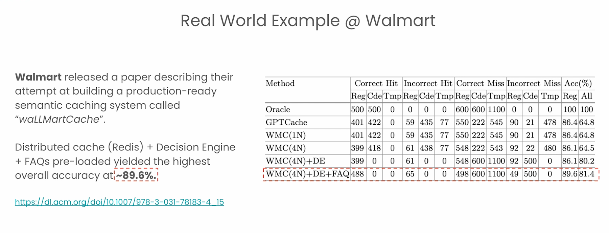

# Semantic Caching Notes — 2026-07-04

## Course idea

Semantic cache = cache by meaning, not exact words.

Example:

- “How can I get a refund?”
- “I want my money back.”

Exact cache sees different words. No hit.
Semantic cache sees close meaning. Possible hit.

## How it works

- Make embedding for new question.
- Compare with old cached questions.
- If distance/similarity passes threshold, reuse old answer.
- If not, call model and store new answer.

Caveman version:

- Exact cache: same words, use old answer.
- Semantic cache: same meaning, maybe use old answer.

## Main danger

Same meaning does not always mean same answer.

Example:

- User A: “What is refund policy for my product?”
- User B: “What is refund policy for my product?”

Words same. Intent same. But context different.

- User A bought phone. Refund window maybe 7 days.
- User B bought TV. Refund window maybe 15 days.

If cache only sees text, it may return wrong policy.

Caveman rule:

> Same words not enough. Same meaning not enough. Need same context.

## Better design

Use context-aware semantic caching.

Cache should include things like:

- intent: refund policy
- user or tenant
- order id
- product type
- product category
- region/store
- purchase date
- policy version/date

Do not blindly cache:

```text
"refund policy" -> "15 days"
```

Better cache inside context bucket:

```text
intent=refund_policy
product_type=TV
region=US
policy_version=2026-07
answer="TV can be returned within 15 days."
```

## Safe flow

1. Understand user intent.
2. Fetch user/order/product facts from core database.
3. Apply correct policy.
4. Check semantic cache only inside same context.
5. If cache hit is safe, reuse answer.
6. If not safe, call LLM/tool and store answer with metadata.

## Threshold tradeoff

Threshold controls how strict match is.

- Loose threshold = more hits, more risk.
- Strict threshold = fewer hits, safer answers.

Metrics from course:

- Hit rate: how often cache helps.
- Precision: when cache says hit, how often correct.
- Recall: how many correct possible hits it catches.

## Ways to improve

Course mentions:

- Redis semantic cache SDK.
- TTL so stale answers expire.
- Separate caches per user/team/tenant.
- Cross-encoder re-ranking for better match check.
- Small LLM check: “Are these questions really same?”
- Fuzzy matching for typos.
- Confusion matrix to see wrong hits/misses.

## Walmart / waLLMartCache example



Course transcript + slide mention Walmart-style production semantic cache: `waLLMartCache`.

Slide/paper link was blocked with 403 in the conversation, but image gives key points.

Big point:

> Semantic cache alone is not enough for production.

Walmart-style system adds extra safety:

- Redis/distributed cache: cache works across many nodes.
- Decision Engine: decides when cache should NOT answer.
- FAQ preload: trusted common answers are loaded before users ask.
- Best row in slide: `WMC(4N)+DE+FAQ`.
- Accuracy shown: `89.6%` for regular queries, `81.4%` overall/all.

Decision Engine can bypass cache for risky queries:

- code questions
- time-sensitive questions
- questions needing fresh data
- questions needing user/product/order context

If risky, go normal LLM/RAG/database path.

Caveman version:

- Cache is shortcut.
- Shortcut not always safe.
- Decision Engine asks: “safe to use shortcut?”
- If no, do real lookup.

The best setup in transcript was WMC + Decision Engine + FAQ preload.
It got close to 90% accuracy because wrong cache hits reduced.

This supports our doubt:

Refund question may look same, but product/user/time can change answer.
So production cache needs guardrails, metadata, and database grounding.

Better name for this full setup:

- production semantic caching with decision engine
- context-aware semantic caching
- semantic cache with policy/metadata guardrails

## Is this hybrid search?

Not exactly.

Hybrid search usually means:

```text
keyword search + vector search
```

This case is better called:

- context-aware semantic caching
- semantic cache with metadata filters
- database-grounded semantic cache
- RAG-aware caching

Caveman difference:

- Hybrid search: find using words plus meaning.
- Context-aware cache: same meaning plus same facts/context.

## Final caveman summary

Semantic cache good. Saves cost and time.

But if answer depends on user/product/order, cache must know that.

Meaning match alone can lie.

Need meaning + context + freshness check.
