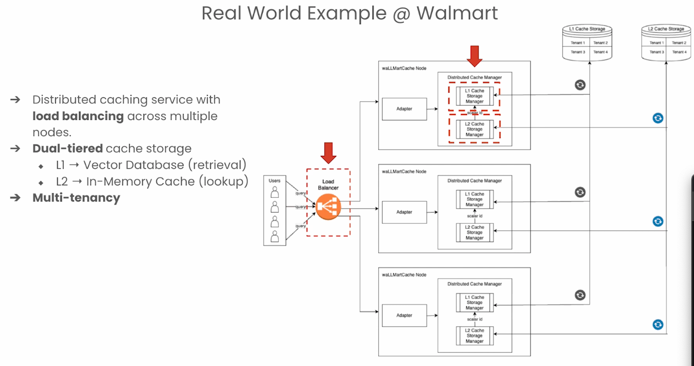
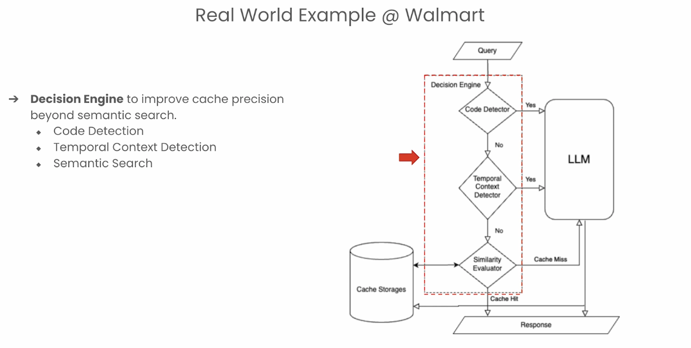
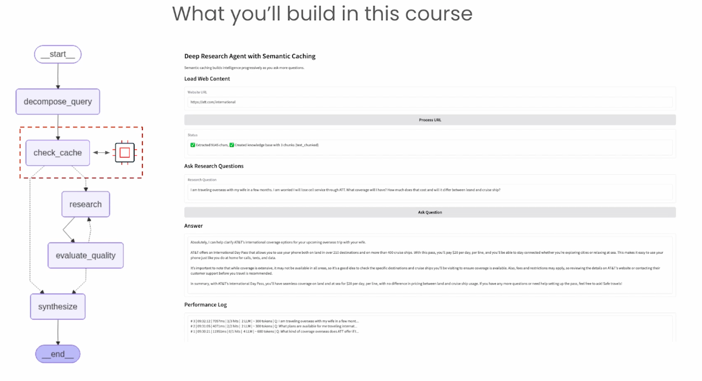

# Semantic Caching Notes — 2026-07-04

## Course idea

Semantic cache = cache by meaning, not exact words.

Example:

- “How can I get a refund?”
- “I want my money back.”

Exact cache sees different words. No hit.
Semantic cache sees close meaning. Possible hit.

## How it works

- Make embedding for new question.
- Compare with old cached questions.
- If distance/similarity passes threshold, reuse old answer.
- If not, call model and store new answer.

Caveman version:

- Exact cache: same words, use old answer.
- Semantic cache: same meaning, maybe use old answer.

## Main danger

Same meaning does not always mean same answer.

Example:

- User A: “What is refund policy for my product?”
- User B: “What is refund policy for my product?”

Words same. Intent same. But context different.

- User A bought phone. Refund window maybe 7 days.
- User B bought TV. Refund window maybe 15 days.

If cache only sees text, it may return wrong policy.

Caveman rule:

> Same words not enough. Same meaning not enough. Need same context.

## Better design

Use context-aware semantic caching.

Cache should include things like:

- intent: refund policy
- user or tenant
- order id
- product type
- product category
- region/store
- purchase date
- policy version/date

Do not blindly cache:

```text
"refund policy" -> "15 days"
```

Better cache inside context bucket:

```text
intent=refund_policy
product_type=TV
region=US
policy_version=2026-07
answer="TV can be returned within 15 days."
```

## Safe flow

1. Understand user intent.
2. Fetch user/order/product facts from core database.
3. Apply correct policy.
4. Check semantic cache only inside same context.
5. If cache hit is safe, reuse answer.
6. If not safe, call LLM/tool and store answer with metadata.

## Threshold tradeoff

Threshold controls how strict match is.

- Loose threshold = more hits, more risk.
- Strict threshold = fewer hits, safer answers.

Metrics from course:

- Hit rate: how often cache helps.
- Precision: when cache says hit, how often correct.
- Recall: how many correct possible hits it catches.

## Ways to improve

Course mentions:

- Redis semantic cache SDK.
- TTL so stale answers expire.
- Separate caches per user/team/tenant.
- Cross-encoder re-ranking for better match check.
- Small LLM check: “Are these questions really same?”
- Fuzzy matching for typos.
- Confusion matrix to see wrong hits/misses.

## Walmart / waLLMartCache example


Course transcript + slide mention Walmart-style production semantic cache: `waLLMartCache`.

Paper (now confirmed): waLLMartCache — *A Distributed, Multi-tenant and Enhanced Semantic Caching System for LLMs*.
Link: https://link.springer.com/chapter/10.1007/978-3-031-78183-4_15

Accuracy table read from slide:

| Method | Acc Reg | Acc All |
|---|---|---|
| Oracle | 100 | 100 |
| GPTCache | 86.4 | 64.8 |
| WMC(1N) | 86.4 | 64.8 |
| WMC(4N) | 86.1 | 64.5 |
| WMC(4N)+DE | 86.1 | 80.2 |
| **WMC(4N)+DE+FAQ** | **89.6** | **81.4** |

Big jump comes from `+DE` (Decision Engine) and `+FAQ` preload, not from more nodes.
Adding nodes alone (`1N` → `4N`) barely moves accuracy — it is about scale, not correctness.

Big point:

> Semantic cache alone is not enough for production.

Walmart-style system adds extra safety:

- Redis/distributed cache: cache works across many nodes.
- Decision Engine: decides when cache should NOT answer.
- FAQ preload: trusted common answers are loaded before users ask.
- Best row in slide: `WMC(4N)+DE+FAQ`.
- Accuracy shown: `89.6%` for regular queries, `81.4%` overall/all.

Decision Engine can bypass cache for risky queries:

- code questions
- time-sensitive questions
- questions needing fresh data
- questions needing user/product/order context

If risky, go normal LLM/RAG/database path.

Caveman version:

- Cache is shortcut.
- Shortcut not always safe.
- Decision Engine asks: “safe to use shortcut?”
- If no, do real lookup.

The best setup in transcript was WMC + Decision Engine + FAQ preload.
It got close to 90% accuracy because wrong cache hits reduced.

This supports our doubt:

Refund question may look same, but product/user/time can change answer.
So production cache needs guardrails, metadata, and database grounding.

Better name for this full setup:

- production semantic caching with decision engine
- context-aware semantic caching
- semantic cache with policy/metadata guardrails

## Distributed architecture (L1 / L2)



waLLMartCache is a distributed caching service with load balancing across many nodes.

Flow:

- Users send queries to a **load balancer**.
- Load balancer routes to one of several `waLLMartCache` nodes.
- Each node has a **Distributed Cache Manager** with two tiers.

Dual-tiered storage:

- **L1 = Vector Database** (retrieval). Holds embeddings, does similarity search.
- **L2 = In-Memory Cache / Redis** (lookup). Holds the actual saved answer by a scalar id.

So flow inside a node:

```text
query -> L1 vector search (find similar question) -> scalar id -> L2 lookup (get saved answer)
```

**Multi-tenancy**: L1 and L2 storage is partitioned per tenant (Tenant 1..4).
Each team/app gets its own bucket so one tenant's cache never leaks to another.

Caveman version:

- Many nodes. Load balancer picks one.
- L1 = find match by meaning.
- L2 = fetch the real answer fast.
- Each tenant has own drawer.

### Doubt: why split L1 and L2 at all?

Good challenge: a vector DB **can** store the payload too. RedisVL's own semantic
cache index holds `prompt`, `response`, `metadata`, and `prompt_vector` together, and
`check()` can return the cached response directly. So L1 is not "unable" to return the answer.

So the split is a **design choice**, not a limitation. Book-index analogy:

```text
L1 = the back-of-book index   "refund policy" -> page 184
L2 = the actual page          page 184 -> full explanation
```

Concrete entry:

```text
L1 (vector DB):   cache_id 8842 | embedding(embed "How do I get refund?") | tenant=A
L2 (Redis):       key 8842      | "You can return eligible TVs within 15 days..."

new query "What is the refund policy?"
  -> embed -> L1 vector search -> closest = cache_id 8842
  -> L2 lookup key 8842 -> return answer
```

Why Walmart separates them at production scale:

- **Keep vector search lean** — L1 holds only embeddings + IDs + tenant + small metadata,
  not bulky LLM responses/documents. Faster, smaller ANN index.
- **Let Redis do what Redis is good at** — L2 does fast key-value reads, TTL/expiry,
  eviction, simple updates/deletes.
- **Tenant separation** — L1 searches only inside a tenant's partition; the id it returns
  (e.g. `A-8842` vs `B-3109`) points into that tenant's L2 slice.

Answer to the challenge in one line:

```text
Can L1 return payload directly?   Yes.
Is Walmart doing that here?        No — L1 returns an id, L2 returns the payload.
Why split?                         Separate semantic search from fast object storage:
                                   cleaner scaling, TTL/eviction, and tenant isolation.
```

## Decision Engine flow (the gate)



Decision Engine improves cache **precision** beyond plain semantic search.
It is the "should we even use cache?" gate, checked before similarity search.

Flow:

```text
query
  -> Code Detector?        yes -> LLM (skip cache)
       no
  -> Temporal Context?     yes -> LLM (skip cache)
       no
  -> Similarity Evaluator  -> cache hit  -> return cached answer
                           -> cache miss -> LLM, then store answer
```

Why each gate:

- **Code Detector**: code queries are risky, tiny diff changes the answer. Don't cache.
- **Temporal Context Detector**: time-sensitive queries (price today, latest status, current policy) go stale. Don't cache.
- **Similarity Evaluator**: only safe, normal questions reach here — the actual semantic lookup.

Caveman version:

- Code? don't cache.
- Time-sensitive? don't cache.
- Safe normal question? try semantic cache.
- Hit = fast answer. Miss = ask LLM.

## Three cache types (grounded)

From RedisVL docs + RAG-caching papers, these are different things people call "semantic cache":

- **Semantic response cache**: stores the final LLM answer. Key = prompt (+ filters), value = answer + metadata. Supports threshold, TTL, access control. (RedisVL `SemanticCache`)
- **Retrieval / RAG cache**: stores retrieved docs/DB results *before* generation. On hit, skip the vector DB lookup; LLM still writes a fresh answer. (arXiv 2503.05530)
- **Profile / context filters**: `user_id`, `tenant`, `account_type`, `region` on each entry — prevents wrong cross-user reuse.

One-line rule:

```text
Do not cache just: meaning(query)
Cache with:        meaning(query) + filters/context
Bypass cache when: code, time-sensitive, risky, or context missing
```

The refund example is exactly **context-aware semantic caching** — plain query-only cache gives wrong hits when similar queries have different hidden context (arXiv 2506.22791 ContextCache).

Grounding sources:

- RedisVL LLM cache: https://redis.io/docs/latest/develop/ai/redisvl/user_guide/llmcache/
- Approximate caching for RAG: https://arxiv.org/abs/2503.05530
- ContextCache (multi-turn): https://arxiv.org/abs/2506.22791
- waLLMartCache paper: https://link.springer.com/chapter/10.1007/978-3-031-78183-4_15

## Course project — what we build



End goal: a **LangGraph** deep-research agent with semantic cache inside.

Graph flow:

```text
start -> decompose_query -> check_cache -> research -> evaluate_quality -> synthesize -> end
```

- **decompose_query**: split one big question into smaller sub-questions.
- **check_cache**: for each sub-question, look in semantic cache first.
- **research**: on miss, scrape/search loaded content + call LLM.
- **evaluate_quality**: not good enough? loop back and research more.
- **synthesize**: stitch all sub-answers into one personalized final answer.

Why cache is highlighted: one agent run fires many sub-questions. Without cache every
sub-question re-hits the LLM/RAG. With cache, repeated sub-questions get cheap.

Demo UI: load a website URL → extract chunks → build knowledge base → ask question →
performance log shows per-step LLM/cache hits, time, and tokens.

### Key insight: cache at the sub-question level

The important nuance is **where** the cache sits. It caches *sub-questions*, not the whole
messy user question.

The full user question rarely repeats:

```text
"I'm traveling overseas with my wife in a few months. Reliable AT&T service?
 What coverage, how much, and does it differ on land vs cruise ship?"
```

But after `decompose_query`, the pieces are reusable across users:

```text
Q1: What AT&T international plans exist?          <- likely repeats
Q2: What does the International Day Pass cost?    <- likely repeats
Q3: Does AT&T work on cruise ships?              <- likely repeats
Q4: Is it charged per line?                       <- likely repeats
```

A later, totally different question ("Going to Italy on a cruise, what AT&T plan?")
overlaps on Q1/Q3 → cache hits on the sub-questions, only Italy-specific part needs research.

So the mental model ladder:

```text
Bad:      cache the final answer to each big user question   (almost never hits)
Better:   cache reusable sub-results inside the research loop
Best:     cache sub-results only when context, freshness, and safety checks pass
```

### The freshness danger

Sub-question caching is powerful but can go stale. A cached "Day Pass costs $10/day" is
wrong after a price change. So each cached sub-answer needs a freshness gate:

```text
sub-question -> check_cache -> found?
  -> Is it fresh?  TTL valid?  policy version same?  time-sensitive?
       yes -> use cached answer
       no  -> re-research / RAG
```

Cache when: repeated/reusable, not personal, not stale, context matches, high confidence.
Refresh/skip when: pricing/policy may have changed, needs account data, or depends on
date/location/order/profile. Same rule as the Decision Engine — just applied per sub-answer.

## Is this hybrid search?

Not exactly.

Hybrid search usually means:

```text
keyword search + vector search
```

This case is better called:

- context-aware semantic caching
- semantic cache with metadata filters
- database-grounded semantic cache
- RAG-aware caching

Caveman difference:

- Hybrid search: find using words plus meaning.
- Context-aware cache: same meaning plus same facts/context.

## Final caveman summary

Semantic cache good. Saves cost and time.

But if answer depends on user/product/order, cache must know that.

Meaning match alone can lie.

Need meaning + context + freshness check.
